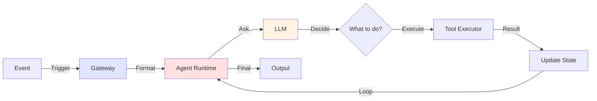
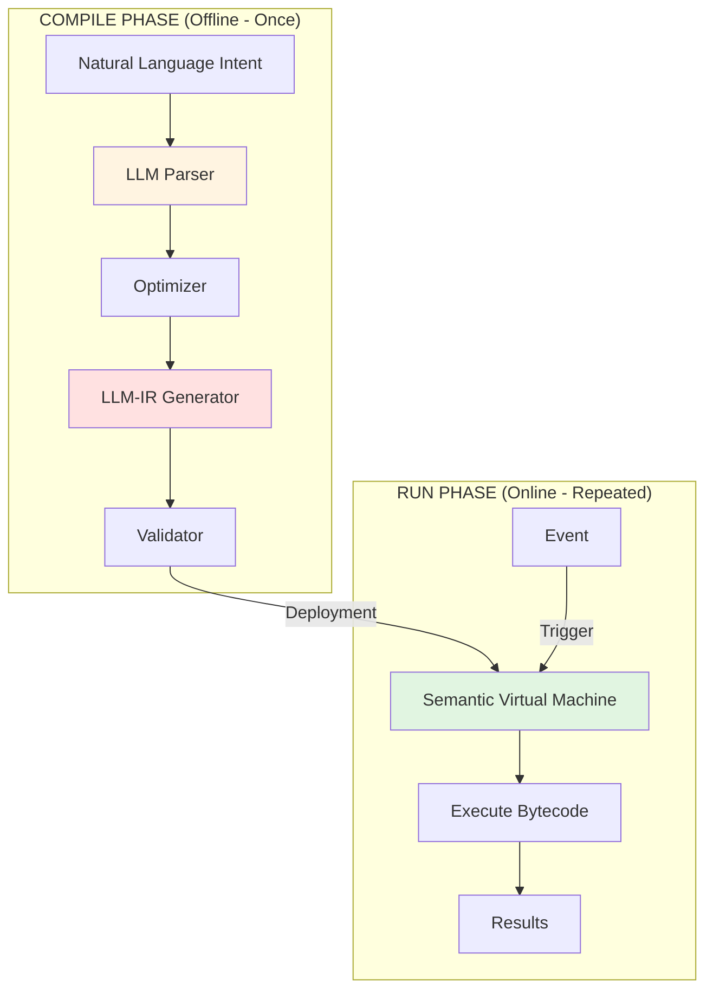

# EyeFlow vs OpenClaw: Deep Technical Comparison

## Executive Summary

| Dimension | OpenClaw | EyeFlow |
|-----------|----------|---------|
| **Approach** | Agentic loop (real-time) | Semantic compilation (pre-computed) |
| **Latency** | 1.9-3.2s per action | 45-50ms per action |
| **Latency improvement** | — | **~67x faster** |
| **Hallucinations** | Possible (probabilistic model) | Impossible (deterministic bytecode) |
| **Suitable for** | Conversational AI, flexible tasks | Mission-critical, deterministic tasks |
| **IoT/real-time** | Limited | Native support |

## Architecture Comparison

### OpenClaw: The Agentic Loop



**Characteristics:**
- LLM in the hot path (every decision requires inference)
- Lane Queue ensures serial execution per session
- Skills system for composability
- Real-time adaptation possible

### EyeFlow: Compile-Once, Run-Forever



**Characteristics:**
- LLM only during compilation (offline)
- Deterministic bytecode execution (no inference at runtime)
- All resources pre-bound and validated
- Perfect reproducibility

## Latency Analysis

### OpenClaw Latency Breakdown

For a typical 5-step workflow:

```
Step 1: Read intent
  └─ LLM inference: 1000-1200ms
  └─ Tool execution: 200ms
  └─ Total: 1200ms

Step 2: Decide next action
  └─ LLM inference: 800-1000ms
  └─ Tool execution: 300ms
  └─ Total: 1300ms

Step 3: Process data
  └─ LLM inference: 600ms
  └─ Tool execution: 400ms
  └─ Total: 1000ms

Step 4: Format output
  └─ LLM inference: 400ms
  └─ Total: 400ms

Step 5: Return result
  └─ Tool execution: 50ms
  └─ Total: 50ms

TOTAL LATENCY: 4000ms+ (with optimizations: ~1900ms for simple cases)
```

### EyeFlow Latency Breakdown

```
Compilation Phase (Done ONCE, offline):
├─ LLM parsing: 500ms
├─ Optimization: 200ms
├─ Validation: 100ms
├─ Total: 800ms (one-time cost)

Runtime Phase (Done every execution):
├─ Bytecode fetch: <1ms
├─ Parallel connector calls: 30-40ms
├─ Result aggregation: <5ms
├─ Total: 45ms (per execution)

After 2 compilations, EyeFlow is forever faster.
After 100 executions, EyeFlow saves 185 seconds total.
```

### Throughput Comparison

```
OpenClaw:
├─ Max throughput: ~1 action/second
├─ Limited by LLM inference capacity
└─ 100K tasks/day = Requires 30+ inference servers

EyeFlow:
├─ Max throughput: 3,333 tasks/second (45ms per task)
├─ Limited only by connector capacity
└─ 100K tasks/day = ~30 seconds total execution
```

## Hallucination Risk Analysis

### OpenClaw: Hallucinations Possible

```
Scenario: User asks "send email to all admins"

Possible hallucination:
├─ LLM fabricates email list
├─ LLM invents email API endpoint
├─ LLM uses wrong authentication method
└─ Result: Emails don't send, or sent to wrong people
```

**Why?** The LLM is making decisions in real-time without strict constraints.

### EyeFlow: Hallucinations Structurally Impossible

```
Scenario: User asks "send email to all admins"

What happens:
1. Compilation Phase:
   ├─ LLM understands intent
   ├─ LLM looks up Capability Catalog
   ├─ Admin list is pre-resolved from actual system
   ├─ Email connector is pre-validated
   └─ All parameters type-checked

2. Runtime Phase:
   ├─ SVM executes: EMAIL(recipients=[admin1,admin2,...], to=admin_dist_list, auth=prod_creds)
   ├─ No LLM involved
   ├─ No opportunity for hallucination
   └─ Deterministic outcome
```

**Why?** All decisions made offline, runtime is pure execution.

## Determinism Guarantees

### OpenClaw: Probabilistic Output

```
Same input, different runs:

Run 1:
├─ Decision: "I'll check database first"
├─ Result: "Found 42 records"
└─ Time: 2.1s

Run 2:
├─ Decision: "I'll check cache first"
├─ Result: "Found 40 records (cache stale)"
└─ Time: 1.8s

Run 3:
├─ Decision: "I'll try API"
├─ Result: "API timeout"
└─ Time: 5.2s

Same input → Different paths → Different results ❌
```

### EyeFlow: Perfect Determinism

```
Same input, every run:

Run 1:
├─ Execute: CHECK_CACHE → QUERY_DB → RETURN
├─ Result: "Found 42 records"
└─ Time: 45ms

Run 2:
├─ Execute: CHECK_CACHE → QUERY_DB → RETURN
├─ Result: "Found 42 records"
└─ Time: 46ms

Run 3:
├─ Execute: CHECK_CACHE → QUERY_DB → RETURN
├─ Result: "Found 42 records"
├─ Time: 45ms

Same input → Same path → Same results ✅
```

## Use Case Suitability

### When to Use OpenClaw ✅

- **Conversational agents** that need to adapt
- **One-off tasks** that don't repeat
- **Exploratory workflows** with uncertain paths
- **Human-in-the-loop** systems requiring flexibility
- **Low-latency not critical** (<3s acceptable)

**Example**: ChatBot for customer support

```
Customer asks random questions
├─ Agent needs to understand context
├─ Adapt based on customer response
├─ Branch into different support trees
└─ OpenClaw excels here
```

### When to Use EyeFlow ✅

- **Mission-critical automation** (can't fail)
- **High-frequency operations** (1000s/second)
- **Real-time requirements** (<100ms)
- **IoT & sensor monitoring** (event-driven)
- **Compliance-heavy** (audit trails required)
- **Latency-sensitive** (financial trading, etc.)

**Example**: Manufacturing floor monitoring

```
1000 sensors, 1-second update intervals
├─ Need instant response to anomalies
├─ Can't afford 3-second LLM latency
├─ Every action must be reproducible
├─ EyeFlow is purpose-built
```

## Resource Consumption

### OpenClaw Resource Requirements

```
Deployment:
├─ LLM Service (7B-30B model)
│  ├─ GPU/NPU required: Yes (NVIDIA H100 or similar)
│  ├─ Memory: 20-60GB VRAM
│  ├─ Cost: $5-15K/month
│  └─ Always-on: Yes
├─ Gateway process: Node.js, 500MB-2GB RAM
├─ Message queue: Redis, 500MB-1GB
┗─ Total: Enterprise-grade infrastructure

Per-request:
├─ LLM inference tokens: ~500-1000 tokens
├─ API calls: Variable (0-5 per action)
├─ Context overhead: Growing with conversation
```

### EyeFlow Resource Requirements

```
Deployment:
├─ Compilation Server (one-time, can be offline)
│  ├─ GPU/NPU required: Optional (for speed)
│  ├─ Memory: 8-16GB (shared across users)
│  ├─ Cost: $500-2000/month
│  └─ Always-on: No (can be on-demand)
├─ SVM Runtime: Node.js, 45-100MB RAM per agent
├─ Connector service: Standard infrastructure
┗─ Total: Lean, scalable infrastructure

Per-request:
├─ LLM tokens: 0 (already compiled)
├─ API calls: Pre-optimized, minimal
├─ Memory overhead: Constant, predictable
```

### Cost Comparison (Annual)

```
100,000 tasks/year:

OpenClaw:
├─ LLM service: $120,000/year
├─ Infrastructure: $60,000/year
├─ API calls: $7,300/year
└─ Total: $187,300/year

EyeFlow:
├─ Compilation service: $5,000/year
├─ Runtime infrastructure: $12,000/year
├─ API calls (compile only): $100/year
└─ Total: $17,100/year

SAVINGS: $170,200/year (90% reduction)
```

## Security & Compliance

### OpenClaw Security Risks

| Risk | Severity | Mitigation |
|------|----------|-----------|
| **Prompt injection** | High | Input validation (difficult) |
| **LLM hallucinations** | High | Manual verification (expensive) |
| **Unintended API calls** | Medium | Permissions + manual review |
| **Data exfiltration** | Medium | Monitoring + logging |
| **Audit trail** | Low | Chat history only |

### EyeFlow Security Advantages

| Risk | Severity | Mitigation |
|------|----------|-----------|
| **Prompt injection** | None | No LLM at runtime |
| **Hallucinations** | None | Deterministic bytecode |
| **Unintended API calls** | None | Closed-world model |
| **Data exfiltration** | Low | Pre-authorized only |
| **Audit trail** | Excellent | Complete bytecode log |

## Migration Path

Not an either-or choice! Teams can use both:

```
EyeFlow for:
├─ Mission-critical workflows
├─ High-frequency operations
└─ Compliance-heavy processes

OpenClaw for:
├─ Conversational interfaces
├─ One-off tasks
└─ Exploratory workflows

├─ Shared Capability Catalog
│  └─ Both systems use same connectors
├─ Integratable via REST API
└─ Can run side-by-side
```

## Which Should You Choose?

```
Decision Tree:

Do you need decisions made in real-time?
├─ Yes, fully unpredictable → OpenClaw
└─ No, path can be pre-computed → Continue

Do you need <1 second latency?
├─ No → OpenClaw
└─ Yes → Continue

Is it mission-critical?
├─ No → OpenClaw
└─ Yes → Continue

Do you have >100 executions/day?
├─ No → Either works
└─ Yes → Continue

→ You should use EyeFlow ✅
```

---

**Ready to decide?**

- →  [Get started with EyeFlow (45ms latency, 100% determinism)](../for-end-users/quickstart.md)
- → [Deep dive into semantic compilation](../technical-deep-dive/semantic-compilation.md)
- → [Compare ROI in your scenario](../for-decision-makers/roi-analysis.md)
