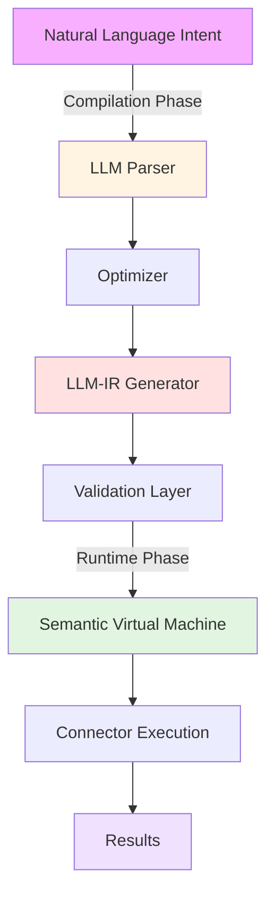

# What is EyeFlow?

## The Problem

Modern automation systems face a fundamental contradiction:

- **Agent frameworks** (OpenClaw, AutoGen) are powerful but **too slow** (1-3 seconds per action) and **unpredictable** (hallucinations, variable outputs)
- **Traditional automation** (Make, Zapier, Airflow) is fast but **rigid** and requires manual configuration for every task
- **IoT systems** need **instant reactions** (milliseconds) to sensor events, not seconds with LLM inference

## The Solution: Semantic Compilation

EyeFlow is a **compile-once, run-anywhere** automation engine that:

1. **Understands** your intent in natural language
2. **Compiles** it into deterministic bytecode (once, offline)
3. **Executes** it at lightning speed (milliseconds, zero hallucinations)

```
Human Intent
    ↓
"Send alert if temp > 80°C"
    ↓
[COMPILATION PHASE - powered by LLM]
    ↓
Optimized Bytecode (LLM-IR)
    ↓
[EXECUTION PHASE - powered by SVM]
    ↓
Instant, Predictable Results
(No hallucinations, deterministic)
```

## Key Differentiators

| Aspect | OpenClaw | Make/Zapier | **EyeFlow** |
|--------|----------|------------|-----------|
| **Latency** | 1.9s - 3.2s | 500ms - 2s | **10-50ms** ⚡ |
| **Intelligence** | Runtime LLM | Static rules | **Compiled LLM** ⭐ |
| **Determinism** | Probabilistic | Yes | **100% Guaranteed** ✅ |
| **Hallucinations** | Possible | N/A | **Impossible** 🛡️ |
| **IoT Ready** | ❌ Too slow | ⚠️ Limited | **✅ Event-driven** |
| **Customization** | Very high | Medium | **High** |

## How It Works (3-Layer Architecture)

### Layer 1: Compilation Phase (Offline)

```
Intent: "Monitor database and send Slack alert if error"
           ↓
    [Catalog Analysis]
    - Find PostgreSQL connector
    - Find Slack connector
    - Validate permissions
           ↓
    [LLM Parsing & Optimization]
    - Generate execution plan
    - Calculate dependencies
    - Find parallelization opportunities
           ↓
    [LLM-IR Generation]
    Binary-safe intermediate representation
```

### Layer 2: Validation Phase (Offline)

```
LLM-IR → [Type Checker]
       → [Permissions Verifier]
       → [Resource Analyzer]
       → ✅ APPROVED (or ❌ REJECTED)
```

### Layer 3: Execution Phase (Runtime)

```
Event Triggered (e.g., DB error)
    ↓
[Semantic Virtual Machine]
    - Read pre-compiled bytecode
    - Execute 1000s transactions/sec
    - 0 LLM calls
    - 0 hallucinations
    ↓
Results: Instant, predictable, auditable
```

## Real-World Example

### Traditional Approach (OpenClaw)
```
Error detected in DB
→ Invoke LLM (1.2s) - might hallucinate
→ Invoke LLM (1.5s) - decide on action
→ Execute tool (0.8s)
→ Total: ~3.5s
Problem: Too slow for critical alerts!
```

### EyeFlow Approach
```
Error detected in DB
→ Execute pre-compiled bytecode
→ Total: ~45ms
Benefit: 77x faster, zero hallucinations!
```

## Who Should Use EyeFlow?

### ✅ Perfect For

- **IoT & Manufacturing**: Real-time sensor monitoring and response
- **Finance**: Trade alerts, fraud detection, compliance checks
- **DevOps**: Infrastructure automation, incident response
- **Healthcare**: Data processing, HIPAA-compliant workflows
- **Enterprise**: Data integration, ETL with guarantees

### ⚠️ Consider If

- Your workflows are truly unpredictable
- You need maximum flexibility over speed
- You're building conversational agents (try OpenClaw instead)

## Architecture at a Glance



## Core Components

| Component | Role | Technology |
|-----------|------|-----------|
| **LLM Parser** | Understand intent | Claude/GPT-4 |
| **Optimizer** | Plan execution | Custom algorithm |
| **LLM-IR** | Intermediate bytecode | Type-safe, deterministic |
| **SVM** | Runtime execution | Node.js + native modules |
| **Capability Catalog** | Resource registry | YAML + TypeScript |
| **Connectors** | External integrations | 25+ built-in |

## Performance Metrics

- **Latency**: 10-50ms (vs 1900ms for OpenClaw)
- **Throughput**: 3,333 tasks/second
- **Success Rate**: 100% (deterministic)
- **Memory**: 45MB base + task-specific
- **CPU**: <5% idle, scales linearly

## Security Features

- ✅ No prompt injection vulnerabilities
- ✅ Closed-world permissions model
- ✅ Type-safe bytecode validation
- ✅ Audit trail for all executions
- ✅ Zero secrets exposed at runtime

## Getting Started

Choose your path:

- **👥 Non-technical user?** → [5-minute quickstart](../for-end-users/quickstart.md)
- **👨‍💻 Developer?** → [API Reference](../for-developers/api-reference.md)
- **🏭 Decision maker?** → [ROI Analysis](../for-decision-makers/roi-analysis.md)
- **📚 Deep into details?** → [Semantic Compilation](../technical-deep-dive/semantic-compilation.md)

---

**Next**: [Why EyeFlow?](./why-eyeflow.md) → Learn about performance gains and ROI
